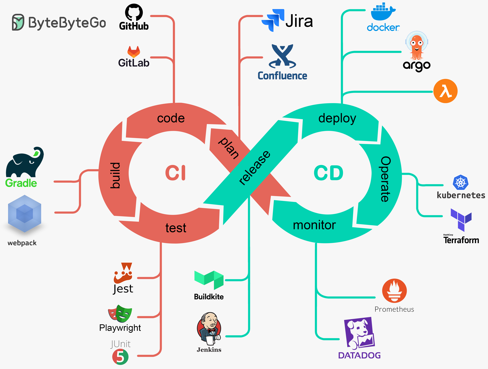
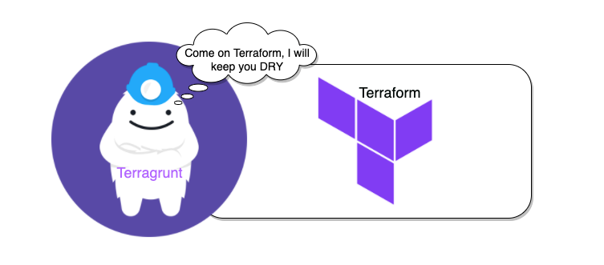

# CI/CD (Continuous Integration & Continuous Deployment) - Kiến Không Ngủ

Tài liệu này cung cấp **tổng quan toàn diện** về quá trình thiết lập và vận hành hệ thống hạ tầng hiện đại bằng cách kết hợp các công cụ:

- **CI/CD (Continuous Integration & Continuous Deployment)** để tự động hóa quá trình phát triển và triển khai phần mềm.
- **Terraform & Terragrunt** cho việc quản lý hạ tầng dưới dạng mã (Infrastructure as Code - IaC), cho phép triển khai nhanh chóng và đồng nhất trên nhiều môi trường.
- **ArgoCD** để triển khai GitOps trên Kubernetes, giúp quản lý cấu hình hạ tầng và ứng dụng một cách an toàn và tự động.
- **AWS Cloud Services** như EKS, VPC, IAM, S3... làm nền tảng cho các thành phần hạ tầng và ứng dụng vận hành trên môi trường đám mây.

## Mục lục

- [1. CICD](#1-cicd)
- [2. Terraform và Terragrunt](#2-terraform-và-terragrunt)
  - [2.1 Terraform](#21-terraform)
  - [2.2 Terragrunt](#22-terragrunt)
- [3. ArgoCD](#3-argocd)
  - [3.1 Khi nào nên dùng ArgoCD?](#31-khi-nào-nên-dùng-argocd)
  - [3.2 Cài đặt ArgoCD trên Kubernetes (EKS)](#32-cài-đặt-argocd-trên-kubernetes-eks)
- [4. AWS](#4-aws)
  - [4.1 IAM](#41-iam-identity-and-access-management)
  - [4.2 VPC](#42-vpc-virtual-private-cloud)
  - [4.3 S3](#43-s3-simple-storage-service)
  - [4.4 DynamoDB](#44-dynamodb)
  - [4.5 ECR](#45-ecr-elastic-container-registry)
  - [4.6 EC2](#46-ec2-elastic-compute-cloud)
  - [4.7 EKS](#47-eks-elastic-kubernetes-service)
  - [4.8 Lambda](#48-lambda)
  - [4.9 API Gateway](#49-api-gateway)
  - [4.10 ELB](#410-elb-elastic-load-balancer)
  - [4.11 CloudWatch](#411-cloudwatch)
  - [4.12 SNS](#412-sns-simple-notification-service)
  - [4.13 SQS](#413-sqs-simple-queue-service)
  - [4.14 Secrets Manager](#414-secrets-manager)
  - [4.15 Route 53](#415-route-53)
- [5. Tài Liệu Tham Khảo](#5-tham-khảo)

## 1. CICD

### 1.1 CICD là gì?

CI/CD là viết tắt của Continuous Integration (Tích hợp liên tục) và Continuous Deployment (Triển khai liên tục).



Là hai khái niệm quan trọng trong phát triển phần mềm hiện đại, đặc biệt trong quy trình DevOps.

- **Continuous Integration (CI)**: Là quá trình tự động hóa việc tích hợp mã nguồn từ nhiều nhà phát triển vào một kho mã chung (repository). Mỗi khi mã được đẩy lên, hệ thống CI sẽ tự động chạy các bài kiểm tra (tests), xây dựng (build) và kiểm tra chất lượng mã để phát hiện lỗi sớm.

- **Continuous Deployment (CD)**: Là bước tiếp theo của CI, trong đó mã sau khi được tích hợp và kiểm tra sẽ được tự động triển khai (deploy) lên môi trường sản xuất hoặc staging mà không cần can thiệp thủ công, đảm bảo phần mềm luôn sẵn sàng phát hành.

### 1.2 Lợi ích của CI/CD bao gồm?

- **Tăng tốc độ phát triển**: Tự động hóa tích hợp và triển khai giúp đẩy nhanh quy trình phát hành phần mềm.

- **Giảm lỗi tích hợp**: Phát hiện và sửa lỗi sớm thông qua kiểm tra tự động khi mã được tích hợp.
Cải thiện chất lượng mã: Các bài kiểm tra tự động (unit tests, integration tests) đảm bảo mã đáng tin cậy hơn.

- **Triển khai liên tục, nhanh chóng**: Cho phép phát hành phần mềm thường xuyên, thậm chí nhiều lần trong ngày.

## 2. Terraform và Terragrunt

Terraform và Terragrunt là hai công cụ được sử dụng trong việc quản lý hạ tầng dưới dạng mã nguồn (Infrastructure as Code - IaC).

### 2.1 Terraform

#### 2.1.1 Terraform là gì?

Terraform là một công cụ mã nguồn mở do HashiCorp phát triển, cho phép định nghĩa và quản lý hạ tầng (như máy chủ, cơ sở dữ liệu, mạng...) thông qua các tệp cấu hình được viết bằng ngôn ngữ HCL (HashiCorp Configuration Language).


Các tính năng chính:
- Tính tự động hóa: Tự động tạo, cập nhật hoặc xóa tài nguyên dựa trên mã.
- Đa nền tảng: Hỗ trợ nhiều nhà cung cấp dịch vụ đám mây và công nghệ khác nhau. Terraform hỗ trợ nhiều nhà cung cấp dịch vụ đám mây (AWS, Azure, GCP), giúp tự động hóa việc triển khai và quản lý hạ tầng.
- Quản lý trạng thái: Lưu trữ trạng thái cơ sở hạ tầng (state) để theo dõi các tài nguyên đã triển khai.
- Tính mô-đun: Cho phép tái sử dụng mã thông qua các module.
- Cộng đồng mạnh mẽ: Có nhiều nhà cung cấp (providers) và module được cộng đồng đóng góp.

#### 2.1.2 Cấu trúc thư mục của Terraform

```plaintext
terraform/
├── modules/                        # Chứa các module tái sử dụng
│   └── vpc/                        # Module tạo VPC
│       ├── main.tf                 # Logic tạo tài nguyên VPC
│       ├── variables.tf            # Định nghĩa các biến cần truyền vào
│       ├── outputs.tf              # Trả ra các giá trị như vpc_id, subnet_id, ...
├── environments/                   # Môi trường triển khai thực tế
│   ├── nonprod/
│   │   └── vpc/
│   │       ├── main.tf             # Gọi module vpc và truyền giá trị biến
│   │       ├── variables.tf        # Định nghĩa biến cục bộ (option)
│   │       ├── terraform.tfvars    # Gán giá trị cụ thể cho biến (dev)
│   │       ├── provider.tf         # Cấu hình nhà cung cấp dịch vụ (AWS)
│   │       └── backend.tf          # Cấu hình remote state (S3, DynamoDB)
│   └── prod/
│       └── vpc/
│           ├── main.tf
│           ├── terraform.tfvars
│           ├── provider.tf
│           └── backend.tf
│
└── README.md                       # Tài liệu dự án
```

Giải Thích:
- **main.tf**: Chứa mã chính của Terraform, định nghĩa các tài nguyên (resources) cần tạo, như máy chủ, mạng, cơ sở dữ liệu...
- **variables.tf**: Khai báo các biến (variables) được sử dụng trong mã Terraform, bao gồm kiểu dữ liệu, giá trị mặc định và mô tả.
- **outputs.tf**: Xác định các giá trị đầu ra (outputs) mà Terraform sẽ trả về sau khi áp dụng, ví dụ: địa chỉ IP của máy chủ, URL của dịch vụ...
- **terraform.tfvars**: Chứa các giá trị cụ thể cho các biến được khai báo trong variables.tf. Tệp này thường được sử dụng để cung cấp giá trị tùy chỉnh cho môi trường cụ thể.
- **provider.tf**: Định nghĩa nhà cung cấp (provider) như AWS, Azure, GCP, và các thông tin xác thực (credentials) hoặc cấu hình cần thiết để kết nối với nhà cung cấp.
- **backend.tf**: Cấu hình backend để lưu trữ trạng thái (state) của Terraform, ví dụ: lưu trên S3, Terraform Cloud, hoặc local.

### 2.2 Terragrunt

#### 2.2.1 Terragrunt là gì?

Terragrunt là một công cụ mã nguồn mở do Gruntwork phát triển, hoạt động như một lớp bao bọc (wrapper) cho Terraform.

Các tính năng chính:
- DRY Configurations: Terragrunt tập trung vào việc giữ mã nguồn **DRY (Don't Repeat Yourself - Không lặp lại)**, giảm sự trùng lặp trong cấu hình.
- Quản lý trạng thái từ xa: Tự động cấu hình và quản lý backend (như S3, GCS) để lưu trữ tệp trạng thái Terraform.
- Quản lý nhiều môi trường: Hỗ trợ triển khai cùng một mã Terraform trên nhiều môi trường với các biến khác nhau. 
Giúp giải quyết các vấn đề phức tạp khi quản lý nhiều mô-đun Terraform hoặc nhiều môi trường (dev, staging, prod).
- Hỗ trợ module và dependencies: Quản lý dependencies giữa các module và cho phép tham chiếu module từ xa hoặc cục bộ.
- Chạy lệnh trên nhiều module: Hỗ trợ lệnh run-all để thực thi Terraform trên nhiều module cùng lúc, tôn trọng thứ tự phụ thuộc.



#### 2.2.2 Cấu trúc thư mục của Terragrunt

Terragrunt yêu cầu một cách tổ chức thư mục có hệ thống hơn so với Terraform thuần để tận dụng tối đa các tính năng của nó.

```plantext
terraform/
├── modules/                        # Chứa các module Terraform tái sử dụng
│   ├── vpc/                        # Module để tạo VPC (Virtual Private Cloud)
│   │   ├── main.tf                 # Logic tài nguyên: aws_vpc, subnet, igw,...
│   │   ├── variables.tf            # Biến input mà module này cần
│   │   └── outputs.tf              # Output ra các giá trị như vpc_id, cidr,...
│   ├── eks/                        # Module để tạo Amazon EKS (Kubernetes cluster)
│   ├── rds/                        # Module để tạo Amazon RDS (Cơ sở dữ liệu)
│   └── s3/                         # Module để tạo S3 bucket (object storage)
├── environments/                   # Thư mục chứa các môi trường triển khai thực tế
│   ├── prod/                       # Môi trường production
│   │   └── us-east-1/              # Khu vực (region) cụ thể: us-east-1 (Virginia)
│   │       ├── vpc/               
│   │       │   └── terragrunt.hcl  # Gọi module VPC cho môi trường prod/us-east-1
│   │       ├── eks/
│   │       │   └── terragrunt.hcl  # Gọi module EKS (Kubernetes) cho prod/us-east-1
│   │       └── rds/
│   │           └── terragrunt.hcl  # Gọi module RDS cho prod/us-east-1
│   └── nonprod/                    # Môi trường non-prod: dev, test, staging,...
│       └── us-east-1/            
│           ├── vpc/
│           │   └── terragrunt.hcl  # Gọi module VPC cho môi trường non-prod
│           ├── eks/
│           │   └── terragrunt.hcl  # Gọi module EKS cho non-prod
│           ├── rds/
│           │   └── terragrunt.hcl  # Gọi module RDS cho non-prod
│           └── app/
│               └── terragrunt.hcl  # Gọi module app (Spring Boot app hoặc tương tự)
└── terragrunt.hcl                  # File cấu hình gốc (root Terragrunt config)
                                    # Dùng để include vào các terragrunt.hcl con
                                    # Cấu hình remote_state, locals, input chung,...
```

Giải Thích:
- **terragrunt.hcl (thư mục gốc)**: Tệp cấu hình Terragrunt chính, chứa các thiết lập chung như backend (ví dụ: S3 để lưu trữ trạng thái) và cấu hình provider (như AWS region). Được kế thừa bởi các tệp terragrunt.hcl trong thư mục con (environments/dev, environments/prod) để tránh lặp lại mã (DRY).
- **Thư mục environments/**: Chứa các tệp cấu hình Terragrunt riêng cho từng môi trường (dev, prod).
dev/terragrunt.hcl:
- **Thư mục modules/**: Chứa các module Terraform tái sử dụng, mỗi module định nghĩa một nhóm tài nguyên liên quan.

## 3. ArgoCD

ArgoCD (Argo Continuous Delivery) là một công cụ triển khai GitOps cho Kubernetes.


Giúp bạn triển khai và quản lý trạng thái của ứng dụng Kubernetes một cách tự động, thông qua các file YAML được lưu trữ trong Git.

> ArgoCD giúp tự động triển khai ứng dụng từ Git lên Kubernetes. Nếu file trong Git thay đổi, ArgoCD sẽ phát hiện và đồng bộ cụm Kubernetes để khớp với trạng thái đó.


Khi nào nên dùng ArgoCD?
- Bạn muốn triển khai ứng dụng theo GitOps (mọi thứ lưu trong Git).
- Bạn có nhiều môi trường (dev, staging, prod) và muốn tách biệt & dễ kiểm soát.
- Bạn triển khai bằng Helm, Kustomize, plain YAML hoặc mix nhiều công cụ.

Ví dụ thực tế:

Bạn có repo Git chứa file cấu hình K8s:

```yaml
deployment.yaml
service.yaml
ingress.yaml
```

Khi bạn cập nhật phiên bản image trong deployment.yaml từ:

```yaml
image: myapp:v1
```

sang:

```yaml
image: myapp:v2
```

> ArgoCD sẽ phát hiện thay đổi và tự động cập nhật Deployment trên cụm Kubernetes cho bạn.

### Cài đặt Argo CD trên Kubernetes (EKS)

Bước 1: Tạo namespace cho Argo CD

```bash
kubectl create namespace argocd
```

Bước 2: Cài đặt Argo CD bằng manifest

```bash
kubectl apply -n argocd -f https://raw.githubusercontent.com/argoproj/argo-cd/stable/manifests/install.yaml
```

Bước 3: Kiểm tra trạng thái triển khai

```bash
kubectl get pods -n argocd
kubectl get svc -n argocd
```

Bước 4: Truy cập Argo CD UI

Mặc định, argocd-server được triển khai dưới dạng ClusterIP. Để truy cập từ bên ngoài, bạn có thể đổi sang LoadBalancer:

```bash
kubectl port-forward svc/argocd-server -n argocd 8888:443

kubectl patch svc argocd-server -n argocd -p \
  '{"spec": {"type": "LoadBalancer"}}'
```

URL: https://localhost:8888

Sau đó kiểm tra IP:

```bash
kubectl get svc argocd-server -n argocd
```

Bước 5: Lấy mật khẩu đăng nhập

Lấy mật khẩu mặc định:

```bash
kubectl get secret argocd-initial-admin-secret -n argocd \
  -o jsonpath="{.data.password}" | base64 -d && echo
```

Trong đó:
- Username: admin
- Password: (kết quả dòng trên)
- URL: http://<external-ip> (hoặc domain nếu có)

Tham Khảo:
- [Trang chủ ArgoCD](https://argo-cd.readthedocs.io/en/stable/)
- [GitHub chính thức của ArgoCD](https://github.com/argoproj/argo-cd)

Setup Instructions

```bash
# Deploy the backend resources first:
cd nonprod/backend
terragrunt init
terragrunt apply

# Deploy the VPC resources:
cd nonprod/vpc
terragrunt init
terragrunt apply

# Deploy the EKS resources:
cd nonprod/eks
terragrunt init
terragrunt apply
```

Terragrunt across all modules:

```bash
terragrunt run-all init
terragrunt run-all plan
terragrunt run-all apply --auto-approve
```

## 4. AWS

AWS (Amazon Web Services) cung cấp nhiều dịch vụ đám mây, trong đó VPC, S3, DynamoDB, EC2, và EKS là những dịch vụ phổ biến, thường được sử dụng trong các dự án và tích hợp với CI/CD, Terraform, hoặc Terragrunt để quản lý hạ tầng.


### 4.1 IAM (Identity and Access Management)

Mô tả: Quản lý quyền truy cập và bảo mật cho các dịch vụ AWS.

Chức năng chính:
- Tạo user, role, policy để kiểm soát quyền truy cập vào tài nguyên.
- Tích hợp với EKS, Lambda, và các dịch vụ khác để quản lý xác thực.

### 4.2 VPC (Virtual Private Cloud)

Mô tả: VPC là dịch vụ cho phép tạo một mạng riêng ảo trong đám mây AWS, cách ly logic các tài nguyên của bạn. Bạn có thể định nghĩa các subnet, route table, security group, và NAT gateway để kiểm soát lưu lượng mạng.

Chức năng chính:
- Tạo mạng riêng với các subnet (public/private) để triển khai tài nguyên.
- Quản lý bảo mật thông qua Security Groups và Network ACLs.
- Kết nối với mạng on-premises qua VPN hoặc Direct Connect.

### 4.3 S3 (Simple Storage Service)

Mô tả: S3 là dịch vụ lưu trữ đối tượng (object storage) có khả năng mở rộng cao, dùng để lưu trữ và truy xuất dữ liệu như tệp, hình ảnh, hoặc bản sao lưu.

Chức năng chính:
- Lưu trữ tệp với độ bền cao (99.999999999%) và khả năng truy cập toàn cầu.
- Hỗ trợ versioning, lifecycle policies, và mã hóa dữ liệu.
- Tích hợp với các dịch vụ như Lambda, CloudFront, hoặc dùng làm backend cho trạng thái Terraform.

### 4.4 DynamoDB

Mô tả: DynamoDB là cơ sở dữ liệu NoSQL được quản lý hoàn toàn, hỗ trợ key-value và document store, phù hợp cho các ứng dụng cần hiệu suất cao và khả năng mở rộng.

Chức năng chính:
- Hỗ trợ truy vấn nhanh với độ trễ thấp, tự động mở rộng (auto-scaling).
- Tích hợp với AWS Lambda để xử lý sự kiện thời gian thực.
- Hỗ trợ khóa trạng thái (state locking) cho Terraform khi dùng S3 backend.

### 4.5 ECR (Elastic Container Registry)

Mô tả: Amazon ECR là một dịch vụ lưu trữ hình ảnh container (container images) tương tự như Docker Hub, nhưng được quản lý bởi AWS, cung cấp tính bảo mật, khả năng mở rộng, và tích hợp với hệ sinh thái AWS.

Chức năng chính:
- Lưu trữ hình ảnh container: Lưu trữ các Docker images hoặc OCI (Open Container Initiative) images.
- Quản lý quyền truy cập: Sử dụng IAM policies để kiểm soát ai có thể đẩy (push), kéo (pull), hoặc quản lý images.
- Public và Private repositories:
  - Private repositories: Chỉ người dùng được cấp quyền trong tài khoản AWS mới truy cập được.
  - Public repositories: Dùng để chia sẻ images công khai (tương tự Docker Hub).

### 4.6 EC2 (Elastic Compute Cloud)

Mô tả: EC2 cung cấp các máy ảo (instances) có thể tùy chỉnh để chạy ứng dụng trên đám mây, với nhiều loại instance (tính toán, lưu trữ, GPU, v.v.).

Chức năng chính:
- Cung cấp tài nguyên tính toán linh hoạt, từ máy chủ web đến xử lý dữ liệu lớn.
- Hỗ trợ Auto Scaling để tự động điều chỉnh số lượng instance dựa trên tải.
- Tích hợp với VPC, ELB (Elastic Load Balancer), và các dịch vụ khác.

### 4.7 EKS (Elastic Kubernetes Service)

#### 4.7.1 EKS (Elastic Kubernetes Service) là gì?

Mô tả: EKS là dịch vụ Kubernetes được quản lý bởi AWS, giúp triển khai, quản lý, và mở rộng các ứng dụng container hóa trên Kubernetes.

Chức năng chính:
- Tự động quản lý control plane của Kubernetes, đảm bảo tính sẵn sàng cao.
- Tích hợp với các dịch vụ AWS như IAM, VPC, và CloudWatch.
- Hỗ trợ triển khai container từ Docker hoặc các registry như Amazon ECR.

#### 4.7.2 Tổng quan hệ thống Kubernetes (EKS)

##### 4.7.2.1 Cluster

Là “cái tổng” — toàn bộ hệ thống EKS của bạn.

- Một cluster bao gồm Control Plane và nhiều Node.

- Là nơi chứa tất cả ứng dụng (pod, service, job,…).

- AWS quản lý phần Control Plane cho bạn trong EKS. AWS quản lý hoàn toàn phần này, bạn không cần triển khai thủ công. AWS tính phí theo giờ cho control plane.

##### 4.7.2.2 Node

Là một máy ảo (EC2) chạy trong cụm EKS — nơi các Pod được thực thi.

- Có thể là Managed Node Group hoặc Self-managed Node.

  - Managed Node Group (do AWS quản lý cập nhật, scaling)

  - Self-managed Node Group

- Chạy các thành phần hệ thống như kubelet, kube-proxy.

- Một node có thể chứa nhiều Pod.

##### 4.7.2.3 Pod

Là đơn vị triển khai nhỏ nhất trong Kubernetes. Chứa 1 hoặc nhiều container.

- Các container trong pod chia sẻ: IP, volume, namespace.

- Thường bạn chỉ chạy 1 container/pod, ví dụ: 1 container Spring Boot.

- Pod được scheduler gán lên Node để chạy.

##### 4.7.2.4 Deployment

Là cách bạn triển khai một nhóm Pod và đảm bảo số lượng Pod mong muốn luôn tồn tại.

- Bạn không triển khai pod trực tiếp mà dùng Deployment.

- Ví dụ: replicas: 3 ⇒ 3 Pod sẽ được tạo và tự scale nếu pod chết.

##### 4.7.2.5 Service

Cung cấp endpoint ổn định để truy cập các Pod.

- Vì Pod IP có thể thay đổi, Service sẽ che chắn điều đó.

- Kiểu phổ biến:

  - ClusterIP: chỉ dùng nội bộ cluster

  - NodePort: expose ra qua cổng Node

  - LoadBalancer: tích hợp với ALB/NLB

##### 4.7.2.6 Namespace

Dùng để phân chia không gian tài nguyên bên trong cluster.

- Mỗi team, môi trường có thể dùng namespace riêng.

- Namespace mặc định: default, kube-system, kube-public.

##### 4.7.2.7 Namespace

Cấu hình cho ứng dụng.

- ConfigMap: chứa thông tin không nhạy cảm (URL, tên DB,…)

- Secret: chứa thông tin nhạy cảm (password, token,…)

##### 4.7.2.8 Volume / PVC

Dùng để lưu trữ dữ liệu lâu dài cho Pod.

- Pod chết thì dữ liệu trong container mất → cần Volume.

- PersistentVolumeClaim (PVC) là cách Pod yêu cầu ổ đĩa.

##### 4.7.2.9 Ingress

Là entry point HTTP/HTTPS để truy cập vào service trong cluster.

- Cho phép định tuyến domain như api.example.com → service-a

- AWS có thể dùng ALB Ingress Controller.

#### 4.7.3 Kiểm tra trạng thái trong EKS

Kiểm tra trạng thái EKS Cluster:

```bash
aws eks describe-cluster --name nonprod-eks-cluster --region us-east-1
```

Kiểm tra Node Group:

```bash
aws eks describe-nodegroup --cluster-name nonprod-eks-cluster --nodegroup-name nonprod-node-group --region us-east-1
```

Cấu hình kubectl để truy cập Cluster:

```bash
aws eks update-kubeconfig --name nonprod-eks-cluster --region us-east-1
```

Kiểm tra Nodes:

```bash
kubectl get nodes
```

Kiểm tra Pods:

```bash
kubectl get pods --all-namespaces
```

Apply ArgoCD Service Account:

```bash
kubectl apply -f nonprod/eks/argocd-service-account.yaml
kubectl patch deployment argocd-server -n argocd -p '{"spec":{"template":{"spec":{"serviceAccountName":"argocd-server"}}}}'
```

### 4.8 Lambda

Mô tả: Lambda cho phép bạn chạy mã (functions) trong các môi trường tính toán được quản lý hoàn toàn, tự động mở rộng theo nhu cầu và chỉ tính phí dựa trên thời gian thực thi. Bạn chỉ cần viết mã (hỗ trợ Python, Node.js, Java, Go, v.v.) và Lambda xử lý mọi thứ từ cơ sở hạ tầng đến scaling.

Chức năng chính:
- Chạy mã theo sự kiện: Lambda được kích hoạt bởi các sự kiện từ các dịch vụ AWS như S3, DynamoDB, API Gateway, CloudWatch, hoặc SNS.
- Serverless: Không cần quản lý máy chủ, hệ điều hành, hoặc cập nhật phần mềm.
- Tự động mở rộng: Lambda tự động scale để xử lý hàng nghìn yêu cầu đồng thời.
- Tính phí theo sử dụng: Chỉ trả tiền cho thời gian tính toán (compute time) thực tế, tính bằng mili giây.

### 4.9 API Gateway

Mô tả: Dịch vụ để tạo, quản lý, và mở rộng các API RESTful, WebSocket, hoặc HTTP, đóng vai trò như một "cửa ngõ" cho các ứng dụng để giao tiếp với các dịch vụ backend như Lambda, EKS, hoặc EC2.

Chức năng chính:
- Tạo API để xử lý yêu cầu HTTP từ client.
- Tích hợp với Lambda, DynamoDB, hoặc các dịch vụ HTTP khác.
- Hỗ trợ xác thực qua IAM, Cognito, hoặc API keys.
- Quản lý lưu lượng (throttling) và giám sát qua CloudWatch.

### 4.10 ELB (Elastic Load Balancer)

Mô tả: Dịch vụ cân bằng tải, bao gồm Application Load Balancer (ALB) và Network Load Balancer (NLB), phân phối lưu lượng đến EC2, EKS, hoặc ECS.

Chức năng chính:
- Phân phối lưu lượng đến nhiều instance/container để tăng tính sẵn sàng.
- Tích hợp với Auto Scaling để mở rộng tài nguyên.
- Hỗ trợ HTTPS với chứng chỉ từ AWS Certificate Manager (ACM).

### 4.11 CloudWatch

Mô tả: Dịch vụ giám sát và quản lý log, thu thập số liệu hiệu suất, và tạo cảnh báo cho các tài nguyên AWS như EC2, Lambda, EKS, hoặc S3.

Chức năng chính:
- Lưu trữ và phân tích log từ pipeline hoặc ứng dụng.
- Tạo dashboard để theo dõi hiệu suất.
- Thiết lập alarms để gửi thông báo qua SNS hoặc kích hoạt hành động (ví dụ: scale EKS).

### 4.11 SNS (Simple Notification Service)

Mô tả: Dịch vụ gửi thông báo qua email, SMS, hoặc các giao thức khác, hoạt động theo mô hình publish/subscribe.

Chức năng chính:
- Gửi thông báo đến người dùng hoặc hệ thống khi có sự kiện (ví dụ: pipeline thất bại).
- Tích hợp với Lambda, SQS, hoặc CloudWatch để xử lý sự kiện.

### 4.12 SQS (Simple Queue Service)

Mô tả: Dịch vụ hàng đợi tin nhắn (message queue), giúp tách biệt và xử lý các tác vụ bất đồng bộ giữa các thành phần ứng dụng.

Chức năng chính:
- Lưu trữ và xử lý tin nhắn giữa các dịch vụ như Lambda, EC2, hoặc EKS.
- Hỗ trợ hàng đợi tiêu chuẩn (standard queue) và FIFO (đảm bảo thứ tự).

### 4.13 Secrets Manager

Mô tả: Dịch vụ lưu trữ và quản lý thông tin nhạy cảm như mật khẩu, API keys, hoặc chuỗi kết nối cơ sở dữ liệu.

Chức năng chính:
- Mã hóa secrets bằng AWS KMS.
- Tự động xoay vòng (rotate) credentials cho RDS, Redshift, v.v.
- Tích hợp với Lambda, EKS, hoặc ECS để truy xuất secrets.

### 4.14 Route 53

Mô tả: Dịch vụ DNS, quản lý tên miền và định tuyến lưu lượng đến các tài nguyên như ALB, CloudFront, hoặc S3.

Chức năng chính:
- Tạo và quản lý DNS records (A, CNAME, MX, v.v.).
- Hỗ trợ health checks để định tuyến lưu lượng đến các tài nguyên khỏe mạnh.
- Tích hợp với ELB và CloudFront.

## 5. Tham Khảo

### 📘 Tài liệu chính thức

- [Amazon EKS – Documentation](https://docs.aws.amazon.com/eks/)
- [Amazon VPC – Documentation](https://docs.aws.amazon.com/vpc/)
- [Amazon IAM – Documentation](https://docs.aws.amazon.com/iam/)
- [Kubernetes – Official Docs](https://kubernetes.io/docs/)

---

### 📗 Terraform & Terragrunt

- [Terraform – AWS Provider](https://registry.terraform.io/providers/hashicorp/aws/latest/docs)
- [Terraform Modules – Best Practices](https://developer.hashicorp.com/terraform/language/modules/develop)
- [Terragrunt – Documentation](https://terragrunt.gruntwork.io/docs/)
- [Terragrunt Include Example](https://terragrunt.gruntwork.io/docs/features/keep-your-terraform-code-dry/)

---

### 📙 CI/CD & GitOps

- [GitHub Actions – Docs](https://docs.github.com/en/actions)
- [ArgoCD – Docs](https://argo-cd.readthedocs.io/en/stable/)
- [Helm – Docs](https://helm.sh/docs/)

---

### 📒 Các hướng dẫn triển khai thực tế

- [AWS EKS with Terraform (by AWS)](https://learn.hashicorp.com/tutorials/terraform/eks)
- [Secure IAM for EKS with IRSA](https://docs.aws.amazon.com/eks/latest/userguide/iam-roles-for-service-accounts.html)
- [EKS Best Practices Guide](https://aws.github.io/aws-eks-best-practices/)

## BUILD

Setup Instructions

```bash
# Deploy the backend resources first:
cd nonprod/backend
terragrunt init
terragrunt apply

# Deploy the VPC resources:
cd nonprod/vpc
terragrunt init
terragrunt apply

# Deploy the EKS resources:
cd nonprod/eks
terragrunt init
terragrunt apply
```

Lệnh Terragrunt

```bash
terragrunt run-all init
```

Lệnh này khởi tạo (initialize) tất cả các module Terragrunt trong thư mục hiện tại (ví dụ: terraform/devops/nonprod/us-east-1). Nó tải provider, thiết lập backend (như S3), và xử lý các phụ thuộc (ví dụ: vpc trước eks). Lệnh này chuẩn bị môi trường cho plan hoặc apply.

```bash
terragrunt run-all plan
```

Lệnh này tạo kế hoạch (plan) cho tất cả các module, hiển thị các thay đổi sẽ được thực hiện trên hạ tầng (như tạo, sửa, xóa tài nguyên)

```bash
terragrunt run-all apply --auto-approve
```

Lệnh này tạo kế hoạch (plan) cho tất cả các module, hiển thị các thay đổi sẽ được thực hiện trên hạ tầng (như tạo, sửa, xóa tài nguyên). Nó tôn trọng thứ tự phụ thuộc (ví dụ: vpc trước eks) và sử dụng mock_outputs nếu module phụ thuộc chưa được áp dụng.

```bash
terragrunt run-all destroy --auto-approve
```

Lệnh này áp dụng (apply) các thay đổi cho tất cả các module, tạo hoặc cập nhật hạ tầng theo kế hoạch. Cờ --auto-approve bỏ qua xác nhận thủ công. Nó thực hiện theo thứ tự phụ thuộc (ví dụ: vpc trước eks), sử dụng output thực tế từ các module phụ thuộc.
